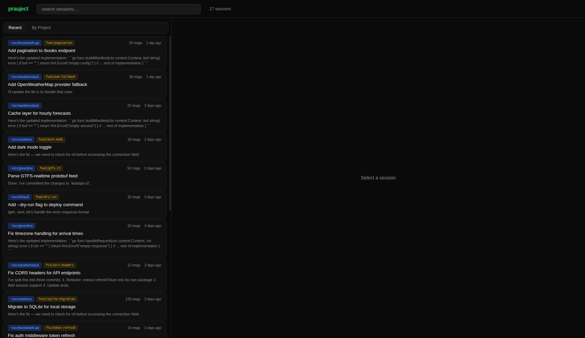
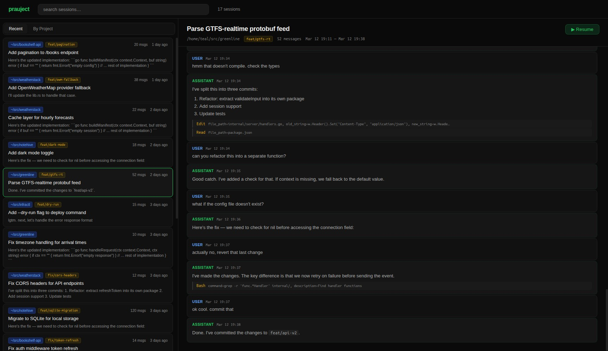

# prauject

Browse, search, and resume [Claude Code](https://claude.ai/code) sessions in a local web UI.




```sh
go install github.com/teal-bauer/prauject@latest
prauject --port 8090
```

Then open [http://localhost:8090](http://localhost:8090).

## Features

- Browse all sessions across all your projects, sorted by recency or grouped by project
- Full-text search across session summaries, prompts, git branches, and message content
- Session detail view with full chat log and markdown rendering
- Resume sessions in a tmux pane, with live terminal output streamed to the browser via WebSocket
- Watches `~/.claude/projects/` and picks up new/updated sessions without a restart

## Requirements

- Go 1.24+
- [Claude Code](https://claude.ai/code) (`claude` CLI in `$PATH`)
- `tmux` (for the resume feature)

## Installation

```sh
go install github.com/teal-bauer/prauject@latest
```

Or build from source:

```sh
git clone https://github.com/teal-bauer/prauject
cd prauject
go build -o prauject .
```

## Usage

```sh
prauject [--port 8090] [--dev] [--claude-arg ARG ...]
```

| Flag | Default | Description |
|------|---------|-------------|
| `--port` / `-p` | `8090` | Listen port |
| `--dev` | `false` | Reload templates from disk on every request |
| `--claude-arg` | | Extra argument passed to `claude` on resume (repeatable) |

```sh
# e.g. to skip the permissions prompt:
prauject --claude-arg --dangerously-skip-permissions
```

Prauject scans `~/.claude/projects/` for session files. Each project directory contains either a `sessions-index.json` (preferred) or individual `.jsonl` files.

When you resume a session, prauject runs `claude [--claude-args] --resume <id>` in a new detached tmux session and streams the output to your browser using xterm.js over WebSocket.

## License

[AGPL-3.0](LICENSE)
